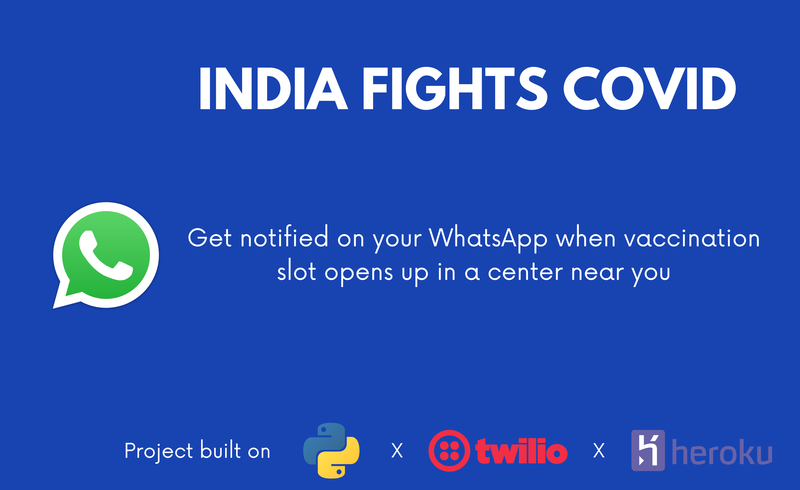
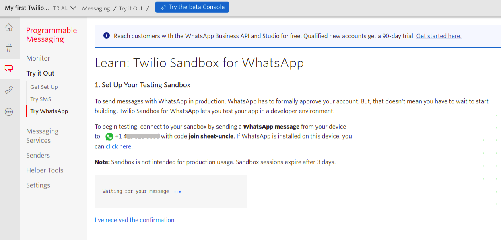
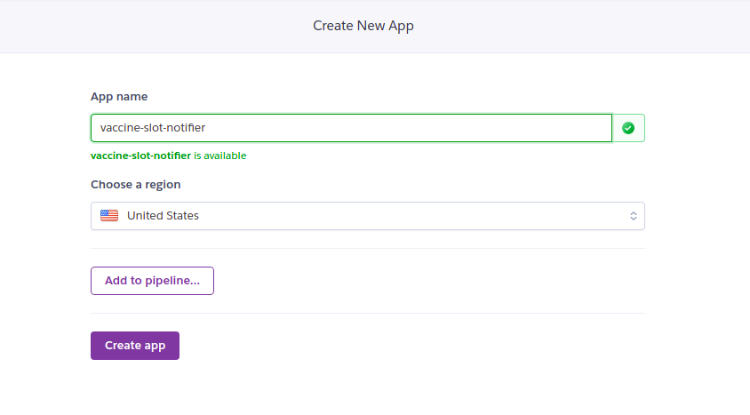
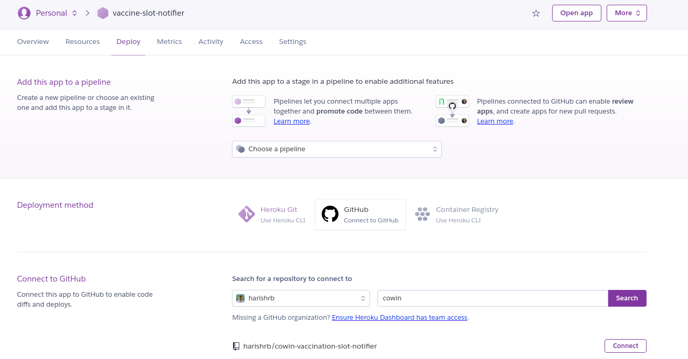
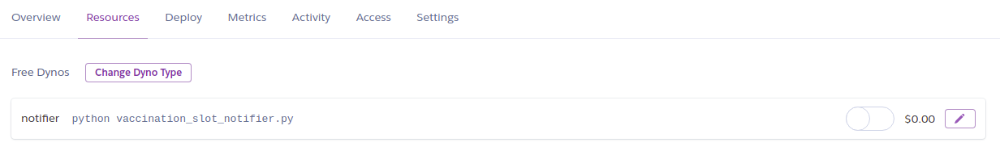

# Vaccination Slot Availability Notification Service


## **Overview of this project**
India has been facing multiple challanges amid second wave of COVID-19. This project is intended to help fellow citizens of India on finding a vaccination slot at the earliest.

If you are from India and struggling to find a vaccination slot, worry not and use this project to your benefit. WhatsApp is in our daily life. So why not use it for our benefit in finding a vaccination slot? Follow along and setup a WhatsApp notification service to get notified on the vaccination slot availability in your area at the earliest.

## **Dependencies**

### Python packages
1. requests
2. twilio
3. schedule
4. configparser

### Third-party accounts
1. Twilio
2. Heroku (optional)

## **Usage**

### Basic Setup
Step 1. Fork this project

Step 2. Head over to [DISTRICTS LOOKUP](DISTRICTS-LOOKUP.md) file and find out district id of your district (You know how to use command/ctrl + F)

Step 3. Head over to [config](config.ini) file and update **district_id** and **beneficiary_age** in the [cowin] section

### WhatsApp notification service setup
Step 1. Sign up for a twilio account using this [link](https://www.twilio.com/try-twilio?promo=3HiRr6)

Step 2. Head over to **Programmable Messaging > Try it Out > Try Whatsapp** on Twilio. Save your twilio WhatsApp sandbox contact number(number that you see on **Try WhatsApp** window) on phone and send join code *(In my case, it is **join sheet-uncle**)* as a WhatsApp message to your number. You have now setup a WhatsApp sandbox. 



Step 3. Head over to Console Dashboard on Twilio. Copy **ACCOUNT SID** and **AUTH TOKEN** and paste it in the [twilio] section of the [config](config.ini) file. Also, update the [config](config.ini) file with your twilio WhatsApp sandbox contact number (same contact number that is saved on your phone).

### Running the project locally
Step 1. Install the packages mentioned in requirements.txt file with *pip*

Step 2. Run the python file *vaccination_slot_notifier.py*

Command line users can run the following commands
```
$ pip install -r requirements.txt
$ python vaccination_slot_notifier.py
```

You can choose to keep it running in the background locally. However, running this project locally is not a great idea. Deploy and run it in Heroku to keep the notification service up at all times.

### Heroku deployment (optional)
Step 1. Sign up for a Heroku account [here](https://signup.heroku.com/login)

Step 2. Click on **Create New App** and choose a simple name for the deployment *(In my case it is **vaccine-slot-notifier**. You can give any name other than this)*. Once you are done naming the application, click on **create app** 



Step 3. In the deployment method, click on **Connect to GitHub** > search for the repository name from GitHub and click on **connect** that is against the repository name of this project. Scroll down to the bottom once you connect and click on **Enable Automatic Deploys** and click on **Deploy Branch**



Project is now deployed on Heroku. One final step is to start execution of the program in Heroku Dyno.

Head over to **Resources** > Click on **Edit dyno formation** > Toggle the swith that is against the program and click **confirm**



Program will now remain active at all times in Heroku Dyno. You should be receiving notification service status on WhatsApp status.

You will be notified when vaccination slot is available in your area. Booking the slot and taking a jab is on you!


```
By using any part of this project, you agree that you will use the project judiciously.

CAUTION - Do not overload the server by keeping shorter time window in scheduler. Owner/Maintainer is not liable for any damage caused.
```

**UPDATE - The availability data fetched by making calls to CoWIN public API may be cached and delayed by upto 30 minutes as per the latest update from the Government of India. This was done as means of fair usage.**

## License
The source code used to format and display the content of this project is licensed under the [MIT license](https://opensource.org/licenses/mit-license.php).
